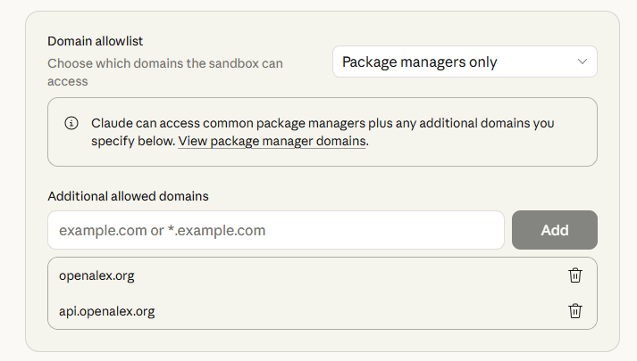

# openalex

## Installing on Claude Desktop

To use this skill in Claude Desktop:

1. Create a ZIP archive of the `skills/openalex/` folder.
2. In Claude Desktop, open the skill installation wizard and load the ZIP file.
3. After installation, open the skill settings and add the required domains to the **Domain allowlist**.

### Required domains

Under *Additional allowed domains*, add:

- `openalex.org`
- `api.openalex.org`

Without these domains, the sandbox will block all API calls and the skill will not work.
