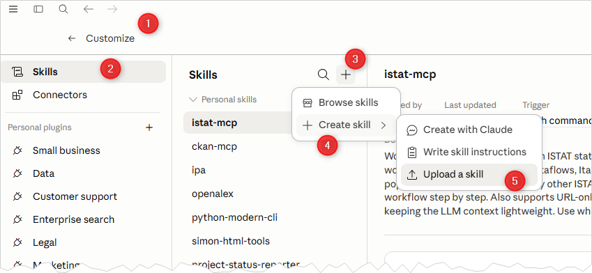

# Releases

Packaged skills ready to install. Each zip contains a single skill — drop it into your AI client or install via CLI.

## Available skills

| Skill | Description | Download |
|-------|-------------|----------|
| [difensore-civico-ti-scrivo](../skills/difensore-civico-ti-scrivo/) | Draft formal complaints to Italy's Difensore Civico per il Digitale (AGID) for CAD and open-data violations | [zip](./difensore-civico-ti-scrivo.zip) |

## Installing a skill

### Command line (Node.js required)

```
npx skills add ondata/skills --skill <skill-name>
```

### Claude Desktop (GUI)

1. Download the zip for the skill you want.
2. Open Claude Desktop → **Customize** → **Skills** → **+** → **Upload a skill**.
3. Select the downloaded zip.



The same "Upload a skill" flow works in other AI clients that support the [Agent Skills](https://agentskills.io) format.
